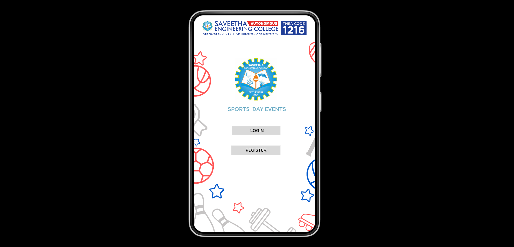
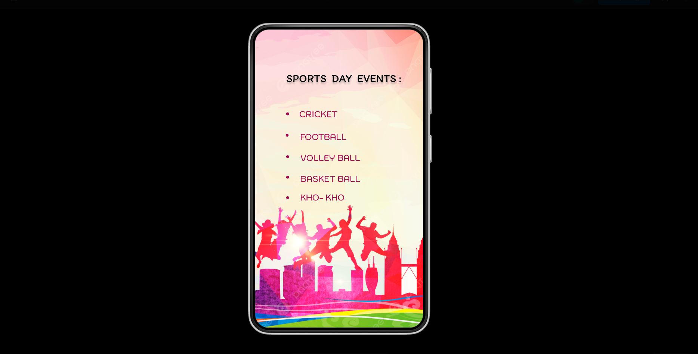
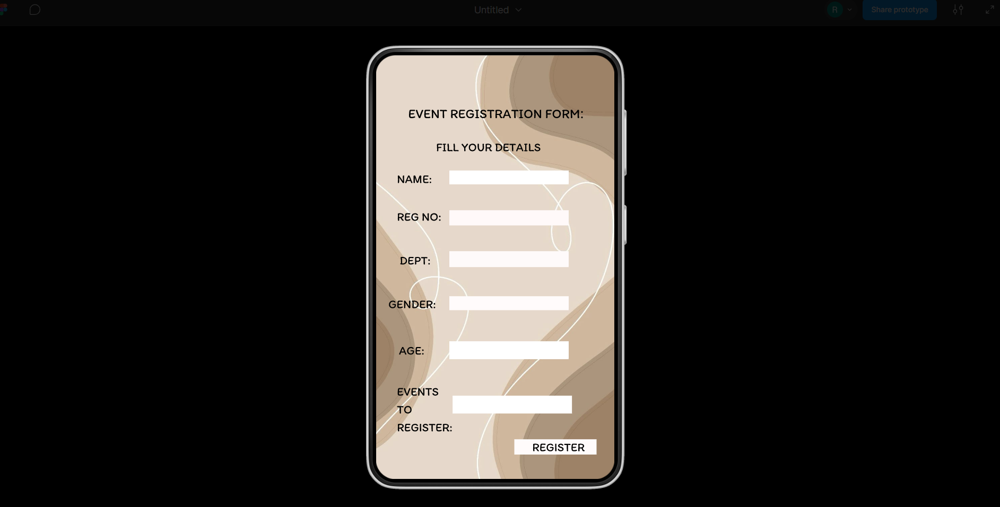
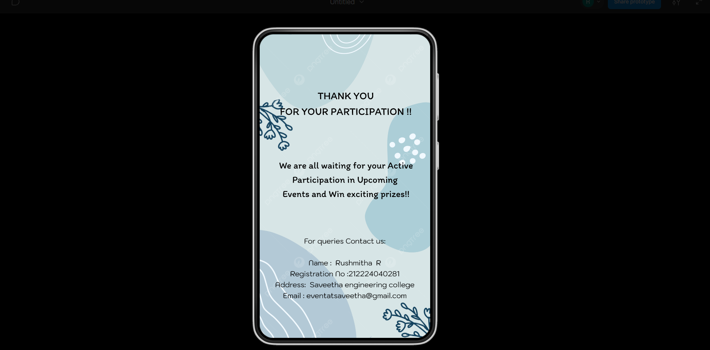

# Ex09 Event Registration Web Application
## Date: 18/05/2025


## AIM:
To design, develop and deploy a web application for event registration.

## DESIGN STEPS:

### Step 1:
Create a new frame.

### Step 2:
Select any one preset size of your choice.

### Step 3:
Select the shapes you need.

### Step 4:
Import images as needed.

### Step 5:
Create pages based on your need and link them.

### Step 6:

Validate the HTML and CSS code.

### Step 6:

Publish the website in the given URL.

## DESIGN TOOL:
Figma

## CODE:
```
Home.html


<!DOCTYPE html>
<html lang="en">
<head>
  <meta charset="UTF-8">
  <meta name="viewport" content="width=device-width, initial-scale=1">
  <title>Sports Day Events</title>
  <link rel="stylesheet" href="styles.css">
</head>
<body>
  <div class="container">
    <header>
      
    </header>

    <main>
      
      <h2 class="title">SPORTS DAY EVENTS</h2>

      <button class="btn">LOGIN</button>
      <button class="btn">REGISTER</button>
    </main>
  </div>
</body>
</html>

styles.css

* {
  box-sizing: border-box;
  margin: 0;
  padding: 0;
}

body {
  font-family: Arial, sans-serif;
  background-color: #fff;
  display: flex;
  justify-content: center;
  align-items: center;
  height: 100vh;
}

.container {
  width: 360px;
  height: 640px;
  border: 2px solid #ccc;
  border-radius: 30px;
  box-shadow: 0 4px 10px rgba(0, 0, 0, 0.2);
  background: url('background-pattern.png') no-repeat center;
  background-size: cover;
  position: relative;
  overflow: hidden;
}

header {
  padding: 10px;
  text-align: center;
}

.college-logo {
  width: 100%;
  max-width: 320px;
  margin-top: 10px;
}

main {
  text-align: center;
  margin-top: 20px;
}

.emblem {
  width: 100px;
  margin: 20px auto;
}

.title {
  color: #5ca9c5;
  margin-bottom: 30px;
  font-size: 18px;
}

.btn {
  width: 200px;
  padding: 12px;
  margin: 10px;
  border: none;
  background-color: #e0e0e0;
  font-size: 16px;
  cursor: pointer;
  border-radius: 6px;
  transition: background-color 0.3s;
}

.btn:hover {
  background-color: #d5d5d5;
}


Page 2


<!DOCTYPE html>
<html lang="en">
<head>
  <meta charset="UTF-8">
  <meta name="viewport" content="width=device-width, initial-scale=1">
  <title>Sports Day Events</title>
  <link rel="stylesheet" href="styles.css">
</head>
<body>
  <div class="container">
    <div class="content">
      <h1>SPORTS DAY EVENTS :</h1>
      <ul>
        <li>CRICKET</li>
        <li>FOOTBALL</li>
        <li>VOLLEY BALL</li>
        <li>BASKET BALL</li>
        <li>KHO- KHO</li>
      </ul>
    </div>
  </div>
</body>
</html>


styles.css


* {
  margin: 0;
  padding: 0;
  box-sizing: border-box;
}

body {
  font-family: 'Arial Rounded MT Bold', sans-serif;
  display: flex;
  justify-content: center;
  align-items: center;
  height: 100vh;
  background-color: #000;
}

.container {
  width: 360px;
  height: 640px;
  background-image: url('background2.jpg'); /* Replace with actual background image */
  background-size: cover;
  background-position: center;
  border-radius: 30px;
  box-shadow: 0 4px 20px rgba(0, 0, 0, 0.5);
  overflow: hidden;
  color: #800020;
  text-shadow: 1px 1px 0 #fff;
}

.content {
  padding: 30px 20px;
  text-align: center;
}

h1 {
  margin-bottom: 30px;
  font-size: 22px;
  font-weight: bold;
  letter-spacing: 1px;
}

ul {
  list-style: disc;
  list-style-position: inside;
  font-size: 18px;
  text-align: left;
  padding-left: 20px;
  color: #b3003b;
}

ul li {
  margin-bottom: 15px;
}


registration page


<!DOCTYPE html>
<html lang="en">
<head>
  <meta charset="UTF-8">
  <meta name="viewport" content="width=device-width, initial-scale=1">
  <title>Event Registration</title>
  <link rel="stylesheet" href="register.css">
</head>
<body>
  <div class="container">
    <form class="form-box">
      <h2>EVENT REGISTRATION FORM:</h2>
      <p>FILL YOUR DETAILS</p>

      <label for="name">NAME:</label>
      <input type="text" id="name" name="name" required>

      <label for="regno">REG NO:</label>
      <input type="text" id="regno" name="regno" required>

      <label for="dept">DEPT:</label>
      <input type="text" id="dept" name="dept" required>

      <label for="gender">GENDER:</label>
      <input type="text" id="gender" name="gender" required>

      <label for="age">AGE:</label>
      <input type="number" id="age" name="age" required>

      <label for="events">EVENTS TO REGISTER:</label>
      <input type="text" id="events" name="events" required>

      <button type="submit">REGISTER</button>
    </form>
  </div>
</body>
</html>


styles.css

* {
  margin: 0;
  padding: 0;
  box-sizing: border-box;
}

body {
  background-color: #000;
  font-family: 'Segoe UI', Tahoma, Geneva, Verdana, sans-serif;
  display: flex;
  justify-content: center;
  align-items: center;
  height: 100vh;
}

.container {
  width: 360px;
  height: 640px;
  background-image: url('background3.jpg'); /* Replace with actual background */
  background-size: cover;
  background-position: center;
  border-radius: 30px;
  padding: 20px;
  box-shadow: 0 4px 15px rgba(0, 0, 0, 0.6);
}

.form-box {
  display: flex;
  flex-direction: column;
  color: #000;
}

.form-box h2 {
  font-size: 18px;
  text-align: center;
  margin-bottom: 10px;
}

.form-box p {
  font-size: 16px;
  text-align: center;
  margin-bottom: 20px;
  font-weight: bold;
}

label {
  font-size: 14px;
  margin-bottom: 5px;
}

input {
  margin-bottom: 15px;
  padding: 6px 10px;
  font-size: 14px;
  border: none;
  border-radius: 4px;
  width: 100%;
}

button {
  align-self: flex-end;
  padding: 8px 16px;
  font-size: 14px;
  font-weight: bold;
  background-color: white;
  border: none;
  border-radius: 4px;
  cursor: pointer;
}


thankyou page

<!DOCTYPE html>
<html lang="en">
<head>
  <meta charset="UTF-8">
  <meta name="viewport" content="width=device-width, initial-scale=1">
  <title>Thank You</title>
  <link rel="stylesheet" href="thankyou.css">
</head>
<body>
  <div class="thankyou-container">
    <div class="message-box">
      <h2>THANK YOU<br>FOR YOUR PARTICIPATION !!</h2>

      <p class="main-text">
        We are all waiting for your Active<br>
        Participation in Upcoming<br>
        Events and Win exciting prizes!!
      </p>

      <div class="contact">
        <p>For queries Contact us:</p>
        <p>Name: Rushmitha R</p>
        <p>Registration No: 212224040281</p>
        <p>Address: Saveetha engineering college</p>
        <p>Email: eventatsaveetha@gmail.com</p>
      </div>
    </div>
  </div>
</body>
</html>


styles.css

* {
  margin: 0;
  padding: 0;
  box-sizing: border-box;
}

body {
  background-color: #000;
  font-family: 'Segoe UI', Tahoma, Geneva, Verdana, sans-serif;
  display: flex;
  justify-content: center;
  align-items: center;
  height: 100vh;
}

.thankyou-container {
  width: 360px;
  height: 640px;
  background-image: url('background4.jpg'); /* Replace with the blue abstract background */
  background-size: cover;
  background-position: center;
  border-radius: 30px;
  padding: 30px 20px;
  text-align: center;
  color: #000;
  box-shadow: 0 4px 15px rgba(0, 0, 0, 0.6);
}

.message-box h2 {
  font-size: 18px;
  font-weight: bold;
  margin-bottom: 20px;
}

.main-text {
  font-size: 15px;
  margin-bottom: 30px;
  font-weight: 500;
}

.contact {
  font-size: 13px;
  line-height: 1.6;
}
```

## OUTPUT:








## RESULT:
The program to design, develop and deploy a web application for event registration is completed successfully.
